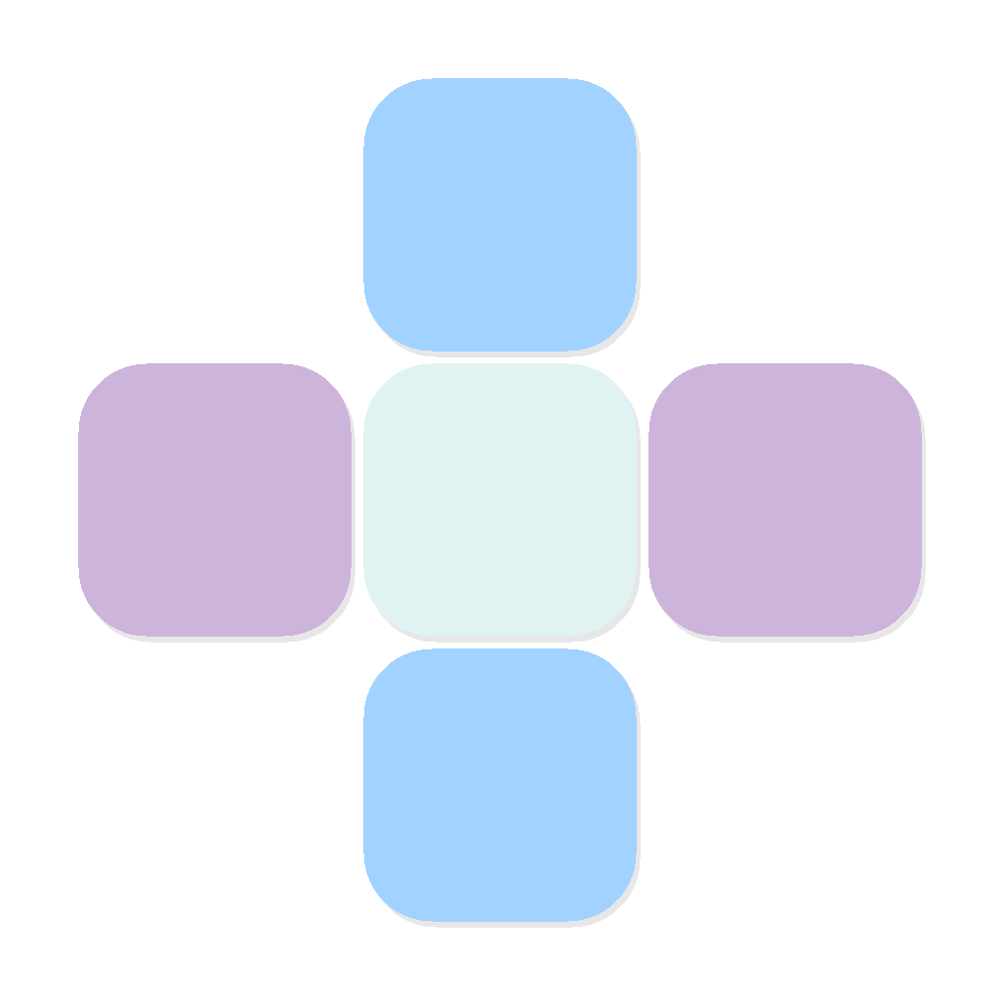

  

<h1 align="center">AutiCare – AI Powered Autism Support & Communication Platform</h1>

  <strong>Helping parents understand autism while empowering children to communicate through AAC tools.</strong>

  
  
  
  

---

## 📌 Problem Statement

According to the World Health Organization (WHO), approximately **1 in 127 children worldwide** is diagnosed with Autism Spectrum Disorder. Yet many parents:

- Struggle to identify early developmental indicators in their children.
- Feel overwhelmed and lack accessible, judgment-free guidance.
- Have limited access to affordable specialists, especially in rural or underserved areas.
- Need practical day-to-day strategies but don't know where to start.

Early identification and informed parenting can dramatically improve outcomes, but the gap between concern and professional help can be months or even years.

## 💡 Our Solution

**AutiCare** bridges that gap by putting supportive tools directly in families' hands. 

Our solution is thoughtfully balanced between two primary goals:
1. **Helping parents** detect early behavioral signs and understand their child's unique needs.
2. **Empowering autistic children** to communicate effectively and confidently.

The platform combines **offline AI guidance** for parents, observational **autism screening tools**, direct **expert access**, and an innovative **AAC visual communication board** for children — all wrapped in a calming, sensory-friendly interface.

---

## ✨ Key Features

### 🤖 AI Parenting Assistant
A fully **offline, keyword-based** assistant that analyses a parent's description of their child's behavior and returns **structured, evidence-informed guidance** — including:
- Understanding the Behavior
- Possible Causes
- Suggested Strategies
- When to Seek Professional Help

Covers **12 behavior categories** with **400+ keyword variations** (e.g., eye contact, meltdowns, sensory sensitivity, picky eating).

### 📋 Autism Risk Screening
- **10 observational questions** based on established developmental indicators.
- Helps parents observe and document behavioral patterns such as:
  - Response to name
  - Eye contact
  - Social attention
  - Interaction patterns
- Calculates a weighted score to indicate potential behavioral indicators.
- *Note: This screening helps identify signs but is NOT a medical diagnosis.*

### 🔍 Expert Connect
Enables quick and simple access to professional help by allowing parents to find autism specialists and therapists in their preferred city.
- Users can directly connect with therapists.
- **WhatsApp Chat button:** Redirects the user to WhatsApp to instantly start a conversation with the therapist.
- **Call button:** Allows users to directly call the expert with a single tap.

### ⭐ AAC Visual Communication Board
A core innovation of AutiCare, this feature provides Augmentative and Alternative Communication (AAC) support for non-verbal or minimally verbal children.

- **Visual Communication:** Allows children to communicate using clear, intuitive visual icons.
- **Text-to-Speech (TTS):** Each icon triggers TTS, so the child’s selection is spoken aloud clearly.
- **Expressive Power:** Helps children effortlessly express emotions, needs, and daily activities.
- **Therapeutic Standard:** Designed using principles widely used by speech therapists and special educators.

---

## 🔄 How It Works

1. **Parent opens the app** and selects **Parent Mode**.
2. They can use the **AI Assistant** for immediate, offline guidance regarding specific behaviors.
3. They complete the **Autism Risk Screening** questionnaire to track behavioral observation patterns.
4. They can easily contact specialists via the **Expert Connect** WhatsApp chat or call buttons.
5. **Child Mode** provides the **AAC visual communication board** to help the child confidently express their daily needs and emotions.

---

## 🛠️ Tech Stack

- **React Native** - Cross-platform mobile framework
- **Expo** - Development platform and native modules
- **TypeScript** - Type-safe JavaScript

---

## 🔮 Future Improvements

### AI Video Behaviour Analyzer
In the future, the app will feature a privacy-first video analysis tool. Parents could upload short videos of their child playing or interacting. The AI would analyze the video to estimate behavioral risk indicators by studying:
- Eye contact behavior
- Repetitive movements
- Facial expressions

The system could then estimate a percentage-based autism risk score to assist with early objective screening before visiting a specialist.

---

## ⚠️ Disclaimer

This application is designed as a support and awareness tool and **does not provide medical diagnosis**. Parents should always consult qualified healthcare professionals—such as developmental pediatricians, child psychologists, or speech-language pathologists—for clinical evaluation and treatment.

---

Made with 💙 for families navigating the autism journey

